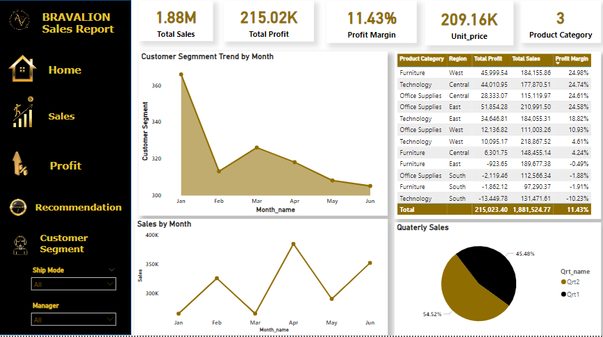
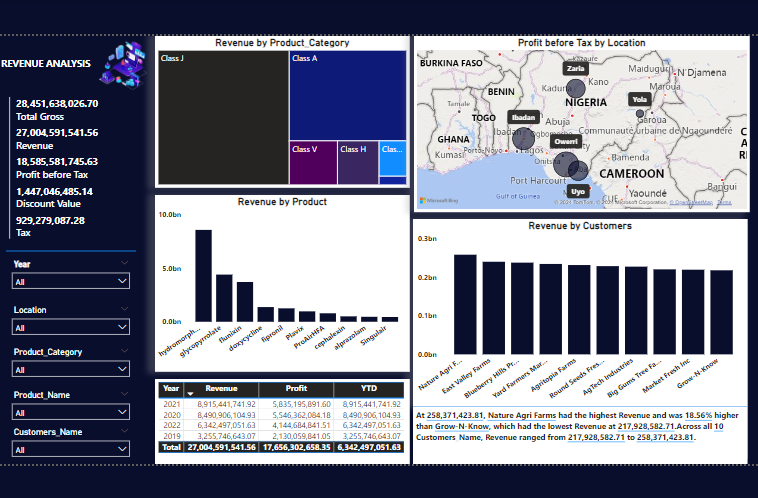

<!--Section 1: Introduce your self-->
## ABOUT ME
I am a data analyst, researcher, and business consultant specializing in data acquisition to drive informed decisions. I analyze trends, consumer behaviour, and industry patterns to help organizations craft effective strategies and deliver impactful solutions. 

<!--Mention your top/relevant skills here - core and soft skills-->
## Skills 

I specialize in acquiring, analyzing, and interpreting data to provide actionable insights and solutions. My expertise lies in:

 ✅ Data Analysis and Visualization: Leveraging tools like Python, R, SQL, Excel, SPSS, STATA and Power BI to uncover trends and present findings clearly.

 ✅ Predictive Modeling and Machine Learning: Developing models to forecast outcomes, optimize processes, and solve complex problems.

 ✅ Business Strategy Development: Crafting data-driven strategies to enhance decision-making and drive organizational growth.

 ✅ Research and Policy Recommendations: Conducting in-depth research to deliver reliable insights and effective policy solutions.

 <!--Section 2: List 3-4 key projects-->
## PROJECT

*A glimpse of some of the projects.*

**Obesity Classification in Adults using Machine Learning**

[View More](https://github.com/Tobigreat/ML-BMI).

**Sales-Performance: Uncover Customer Trend analysis**

[View More](https://app.powerbi.com/view?r=eyJrIjoiMjBiMTJlYTItMTdhOS00NGM4LWIwMzQtNTQyN2RkOWE5ZDNhIiwidCI6ImRmODY3OWNkLWE4MGUtNDVkOC05OWFjLWM4M2VkN2ZmOTVhMCJ9&embedImagePlaceholder=true&pageName=346fa750ec9e8ed9828e)

**Revenue Analysis:The analysis highlights areas of strong performance and potential bottlenecks**

[View More](https://app.powerbi.com/view?r=eyJrIjoiNjMwOTZiOWEtNDMzMi00Zjc2LTk5NzItYjJmM2M0ZTFhNDUzIiwidCI6ImRmODY3OWNkLWE4MGUtNDVkOC05OWFjLWM4M2VkN2ZmOTVhMCJ9&embedImagePlaceholder=true&pageName=ReportSectionbf998f421387f8863047)

**Education Management: Selection of school to be part of a public private partnership**

[View More](https://github.com/Tobigreat/Education-Management-Analysis) 

**Movie Rentals: The potential acquisition and learning more about your rental business**

 

[View More](https://github.com/Tobigreat/Movie-Rentals) 

**Easy Visa project: Business communities in the United States are facing high demand for human resources**

 

[View More](https://github.com/Tobigreat/Visa-project) 

**Customer Churn: Prediction of Customers using Random Forest Classifier**

 

**Contact Details**

*Let us connect and make informed decisons with fact.* 
----------------------------------------------------------

☎️  +2348039293426

-----------------------------------------------------------
📧  ajasaoluwatobi7@gmail.com

-----------------------------------------------------------

🌐  [Linkedln](https://www.linkedin.com/in/oluwatobiajasa/) 

------------------------------------------------------------

